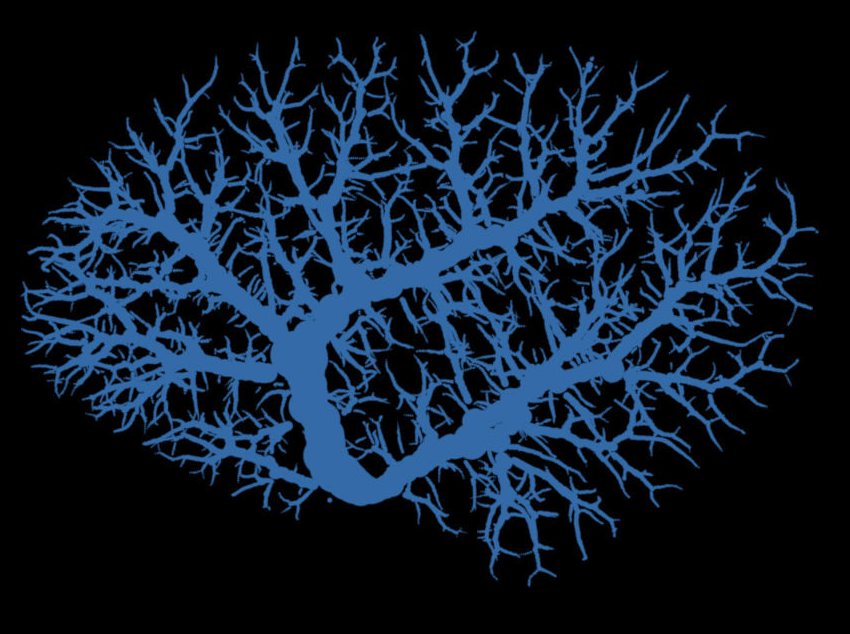
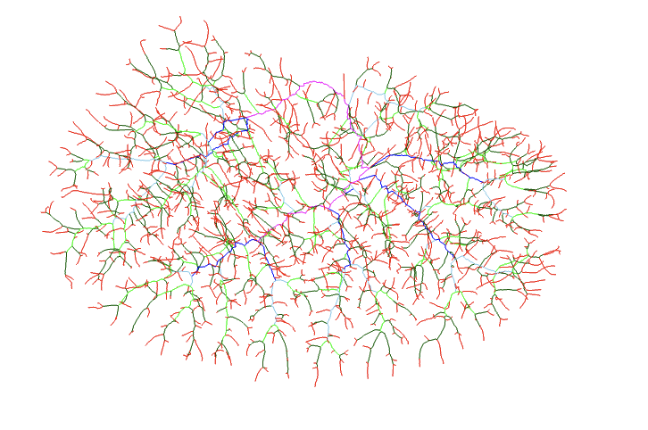

### Project Overview

This project focuses on **skeletonizing the vascular tree** and extracting key structural information, including branch lengths, radii, angles between branches, and hierarchical branch levels.

### Functionality

- **Lengths and radii** are computed using the skeleton dependency, with additional processing to ensure accuracy.
- **Branch angles and hierarchical levels** are implemented and visualized within the project.

### Visualizations

#### Skeletonization Result

#### Length and Radius Extraction

#### Branch Level Assignment

