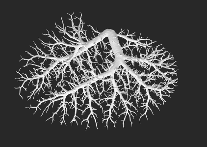

### Project Overview

This project focuses on **skeletonizing the vascular tree** and extracting key structural information, including branch lengths, radii, angles between branches, and hierarchical branch levels.

### Functionality

- **Lengths and radii** are extracted using a skeletonization library, with additional post-processing to ensure precision.
- **Branch angles and hierarchical levels** are computed and visualized as part of the pipeline.

### Visualizations

#### Original Vascular Tree  
The image below shows the original vascular tree used in the experiment, extracted from a mouse tissue slice.

#### Skeletonization Result  
This image illustrates the result of applying the skeletonization algorithm to the vascular tree.

#### Length and Radius Extraction  
Here, each node's radius is visualized, demonstrating how they collectively reconstruct the shape of the original tree.

#### Branch Level Assignment  
This visualization shows how the skeletonized tree is hierarchically segmented using a river-ordering method. All extracted information is ultimately stored in a structured tree format.

